---
hide:
  - navigation
  - toc
  - path
---
<div align="center" width="100%">


[](https://t.me/iownHomecontrol) [](https://discord.gg/MPEb7dTNdN)

</div>

---

<div align="center" width="100%">


<!-- TODO Short introduction on how to use/read this documentation -->

## Naming Conventions & Wording <!-- Clean descriptions of explanations -->

</div>

``` mermaid
%%{init:{
  "theme":"neutral",
  "fontFamily":"monospace",
  "flowchart":{"curve":"linear"}
}}%%

flowchart TB
  subgraph DataFlow["io-homecontrol Data Format Flow"]
    mcu{{"Microcontroller<br/>STM8 / STM32"}}
    radio{{"Radio<br/>SX12xx/Si446x"}}
    ant((("📡<br/>868-870 <br/>MHz")))
    ext["External<br/>PC<br/>Serial over USB<br/>"]
    int["Internal<br/>TaHoma, Cozytouch, ...<br/>SoC or MCU<br/>"]
    ext<--"SLIP"-->mcu
    int<--"SPI"-->mcu
    mcu<--"UART<br/>38400-8N1"-->radio
    radio<--"NRZ"-->ant
  end
```

> [!NOTE]
> Based on the official wording and [Ethernet Frame](https://en.wikipedia.org/wiki/Ethernet_frame) description.

- Session: Abstraction describing the whole communication process for one action (eg. close windows)
- Action: A command executed by the actuator
- Layer 1: Packet = Physical (RF/Radio)
- Packet: Breaks down a session transmission into chunks with each containing a preamble, sync word, frame and interpacket gap.
- Carrier Sense: In case of iohc the abuse of the preamble as detection of an incoming signal. Normally just a unmodulated signal.
- Ramp Up Phase: Time it takes for the radio to initiate the power amplifier.
- Preamble: Sequence of a repeating bit pattern (0101010101...) to synchronize the receiver clock with the sender clock and determine the baud rate. At the same time this is also used to announce a transmission to wake-up a receiver from a low-power mode.
- Sync Word (SFD = Start Frame Delimiter): Breaks the preamble and signals the start of the frame.
- Frame: Data after the sync word including the CRC.
- Postamble: Same as preamble but this time it is to signal the end of a transmission.
- (Interframe/Interpacket) Gap: Time between a repeated packet transmission of a session.
- Layer 2: Frame = Data Link
- Transmission Control / Header: Describes a header (CtrlByte1/2) which holds information about the iohc protocol and frame
- MAC Header: Sender & Receiver NodeID in EUI/OUI-48 form
- NodeID: built-in 3-bytes device address (LSBF!)
  - Used in every communication to identify the transmitter and the receiver(s).
  - Programmed during manufacturing and "cannot be changed" (which is untrue as we will see later...).
  - Predefined ranges exist to differentiate manufacturers, types, etc.
  - Found on the device labels in plain text and as barcode/qr-code.
  - > "NodeIDs are recycled on a 3 to 5 years basis, depending on the product sales."
  - > "NodeID can be considered unique per installation/home."
  - Broadcasts are valid OUI-48 when Bit-Reversed and then Bit-Inverted (see LSBF). 00:00:3F > Reverse > Invert = 03:FF:FF.
    - See: [Universal vs. Local Bit](https://en.wikipedia.org/wiki/MAC_address#Universal_vs._local_(U/L_bit))
    - Mentioned in SDN (Somfy Digital Network) documents and observable via SDN Frame Builder
- Payload: Variable length field after the MAC header excluding the CRC which holds the usable data aka Message
- CRC (FCS = Frame Check Sequence): Calculated over the Frame
  - [CRC/CRC16-CCITT](https://srecord.sourceforge.net/crc16-ccitt.html) vs. [CRC16-KERMIT](https://reveng.sourceforge.io/crc-catalogue/16.htm#crc.cat.crc-16-kermit)
  - Check for yourself with reveng: `reveng.exe -m CRC-16/KERMIT -X -c "%*"`

<!-- TODO Documentation/Project Layout Description
<div align="center" width="100%">

## Project Layout

</div>

```SHELL
scripts        # Random scripts and code snippets
scripts/renode # ioHome STM32 Emulation!!! (Thanks Pascal!)
```
-->
