``` mermaid
%%{init:{
  "theme":"neutral",
  "fontFamily":"monospace",
  "flowchart":{"curve":"linear"}
}}%%

flowchart TB
  subgraph DataFlow["io-homecontrol Data Format Flow"]
    mcu{{"Microcontroller<br/>STM8 / STM32"}}
    radio{{"Radio<br/>SX12xx/Si446x"}}
    ant((("📡<br/>868-870 <br/>MHz")))
    ext["External<br/>PC<br/>Serial over USB<br/>"]
    int["Internal<br/>TaHoma, Cozytouch, ...<br/>SoC or MCU<br/>"]
    ext<--"SLIP"-->mcu
    int<--"SPI"-->mcu
    mcu<--"UART<br/>38400-8N1"-->radio
    radio<--"NRZ"-->ant
  end
```

---
hide:
  - navigation
  - toc
  - path
---


[](https://t.me/iownHomecontrol) [](https://discord.gg/MPEb7dTNdN)

---

Protocol documentation can be accessed via the header. Have a look around ...



# Project Layout

```SHELL
scripts        # Random scripts and code snippets
scripts/renode # ioHome STM32 Emulation!!! (Thanks Pascal!)
```
