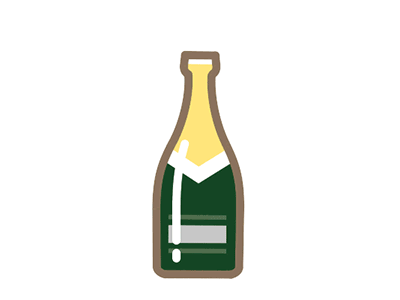

In case you are wondering why there is a picture of a champagne bottle in here:

When you dissect the Overkiz APK (Android App) you will find this file next to the certificates.

This file is never referenced anywhere in the code...
