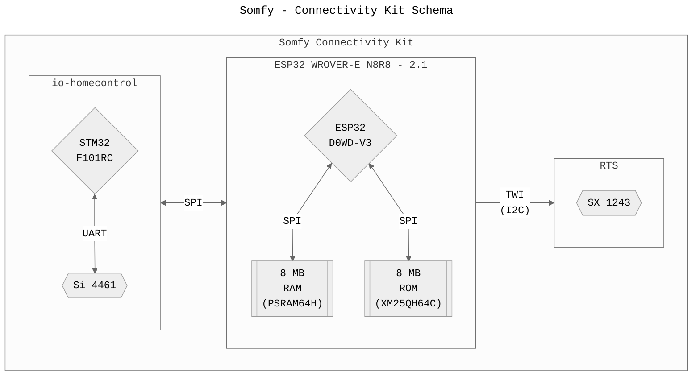
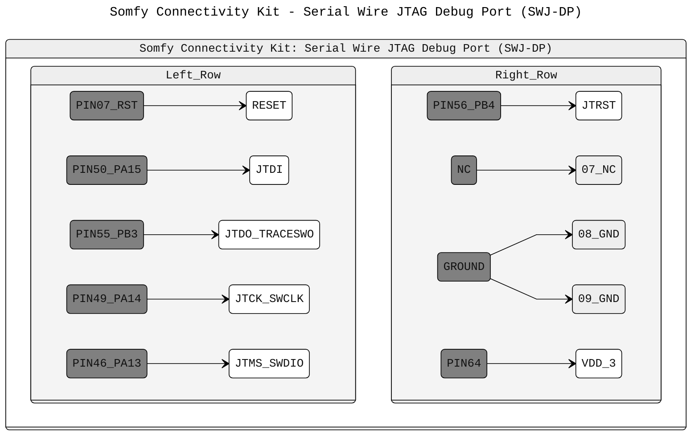

# Somfy - Connectivity Kit

Analysis and Information about the Board Layout, PIN Definitions and ongoing efforts to understand the platform.



> **NOTE**: When referencing PCB directions it is always assumed that we are looking at the top of the PCB with the buttons facing towards you like in the pictures.

## Pin Layout

> **NOTE**: When refering to Pins their Naming Scheme is used and not their actual number on the board itself since this makes mapping to source code and documentation easier ;)

### ESP32 Wrover-E Module

> **Note**: [ESP32 GPIO Summary](https://docs.espressif.com/projects/esp-idf/en/latest/esp32/api-reference/peripherals/gpio.html#gpio-summary)

| ESP32<br>GPIO | STM32<br>PIN | DBG<br>PIN        | FUNCTION                                                                                                                                |
| :-----------: | :----------: | :---------------: | :-------------------------------------------------------------------------------------------------------------------------------------: |
| **LEFT**      |              |                   | **ESP32 LEFT ROW: 1 - 19** (Top>Bottom)                                                                                                 |
| GND           |              |                   | 0                                                                                                                                       |
| 3V3           |              |                   | 1                                                                                                                                       |
| EN            |              |                   | ChipEnable / Reset                                                                                                                      |
| VP            |              | Button:`Prog`     | Button: Right Side                                                                                                                      |
| VN            |              | DBG:1             | Bridge Point 1                                                                                                                          |
| 34            |              | DBG:2             | Bridge Point 2                                                                                                                          |
| 35            |              | DBG:3             | Bridge Point 3                                                                                                                          |
| 32            |              | LED               | LED:Green                                                                                                                               |
| 33            |              | LED               | nc?                                                                                                                                     |
| 25            |              | LED               | LED:White                                                                                                                               |
| 26            |              | :grey_question:   | Debug Port with missing Chip (UART?)                                                                                                    |
| 27            |              | :grey_question:   | Debug Port with missing Chip (UART?)                                                                                                    |
| 14            | 42`TX`       | DBG:Rx            | `HSPI_CK`/ `JTAG TDMS` - TestArea3-Bottom                                                                                               |
| 12            |              | LED               | `HSPI_Q` / `JTAG TDDI` - LED-BlueWiFi<br>*Strap*: LOW for Boot Mode: "*should be kept low when module is on.*"                          |
| GND           |              |                   | 0                                                                                                                                       |
| 13            |              | RTS               | `HSPI_DATA`  / `JTAG CK` - RTS:6CTRL                                                                                                    |
|               |              |                   |                                                                                                                                         |
| **RIGHT**     | **STM32**    |                   | **ESP32 RIGHT ROW: 20 - 38** (Top>Bottom)                                                                                               |
| GND           |              |                   | 0                                                                                                                                       |
| 23            |              | Button/LED        | `VSPI DATA` - Button and LED                                                                                                            |
| 22            |              | RTS               | `UART RTS / VSPI WP` - UpRight-Left<br>RTS:2DATA                                                                                        |
| TXD           |              | UART:Tx           | `UART TX` - UpRight-Right<br>*Strap*: Debug Output                                                                                      |
| RXD           |              | UART:Rx           | `UART RX` - UpRight-Middle<br>*Strap*: HIGH at Boot Mode                                                                                |
| 21            |              | DBG:Unknown       | `VSPI HD` - Debug RightSide of ESP with 3 Contacts (Top)<br>Function Unknown. Could be used in conjunction with IO2 to select Boot Mode |
| nc            |              |                   | nc                                                                                                                                      |
| 19            |              | RTS               | `VSPI Q` / `UART CTS` - RTS:5RST                                                                                                        |
| 18            | `BOOT0`      | STM32:BootMode    | `VSPI CLK`                                                                                                                              |
| 5             |              | UNCORRECT:`Reset` | `VSPI CS` - *Strap*: 0 = BootMode                                                                                                       |
| nc            |              |                   | nc                                                                                                                                      |
| nc            |              |                   | nc                                                                                                                                      |
| 4             | `RESET`      | Button:???/SWD               | `HSPI HD=HOLD` Button: Left Side / SWD:1RST                                                                                             |
| 0             |              | Strap             | `CLK OUT` - Test2-Middle<br>*Strap*: 0 = BootMode                                                                                       |
| 2             |              | Strap             | `HSPI WP=WriteProtect` - Test1-Middle<br>*Strap*: 0 = BootMode                                                                          |
| 15            | 43`RX`       | DBG:Tx            | `HSPI CS` / `JTAG DO` - Test3-Top<br>*Strap*: 1 = Debug Log @ `UART TX`                                                                 |

> **Note**: ESP32 has two I2C channels. Any pin can be set as SDA or SC.
> [Good SPI Explanation](https://randomnerdtutorials.com/esp32-spi-communication-arduino/)
> [ESP32: Boot Mode Selection](https://docs.espressif.com/projects/esptool/en/latest/esp32/advanced-topics/boot-mode-selection.html)

> **Note**: LED Info could also be found here: https://github.com/Overkiz/esp-idf/commit/b553be8a5d074ec39fa5e2beac14c99eb4932388
> **Note**: It seems Overkiz is using the official ESP bootloader and WebIOPi (Python) to test this (or the STM32) via Serial

<details><summary>ESP32 WROVER-E (ESP32-D0WD-V3) GPIO Summary</summary>

| GPIO    | STRAP | Comments           |
| ------: | :---: | :----------------- |
| 00      | 1     | CLK_OUT1           |
| `VSPI`  |       | `VSPI`             |
| 05      | 1     | VSPICS             |
| 18      |       | VSPICLK            |
| 21      |       | VSPIHDA            |
| 23      |       | VSPIDAT            |
| 19      |       | VSPIQPI; U0CTS     |
| 22      |       | VSPIWPT; U0RTS     |
| `HSPI`  |       | `HSPI`             |
| 02      | 0     | HSPIWP             |
| 04      |       | HSPIHDA            |
| 12      | 0     | JTAG:MTDI; HSPIQPI |
| 15      | 1     | JTAG:MTDO; HSPICS  |
| 13      |       | JTAG:MTCK; HSPIDAT |
| 14      |       | JTAG:MTMS; HSPICLK |
| 01      |       | U0TXD; CLK_OUT3    |
| 03      |       | U0RXD; CLK_OUT2    |
| `NoDef` |       | `NO DEFINITION`    |
| 25-27   |       |                    |
| 32-33   |       |                    |
| `GPI`   |       | `INPUT ONLY`       |
| 34-35   |       | GPI                |
| 36      |       | GPI; SENSOR_VP     |
| 37-38   |       | GPI                |
| 39      |       | GPI; SENSOR_VN     |
| `N/A`   |       | `NOT USABLE`       |
| 06-11   |       | SPI0/1; ROM        |
| 16-17   |       | SPI0/1; RAM        |

- **Note**: GPIO34-39 are input only and have no software-enabled pull-up/down!

</details>

### SX1243 Pin Out (RTS)

- SX1243 Interface: TWI = I2C

| SX1243      | ESP32          | DBG<br>PIN | FUNCTION    |
| :---------: | :------------: | :--------: | :---------: |
| 6: `CTRL`   | IO13:`HSPI D`  | I2C        | Data        |
| 2: `DATA`   | IO22:`VSPI WP` | I2C        | Chip Select |
| 5: `nRESET` | IO19:`VSPI Q`  | RESET      | Reset       |

> **Note**: On bigger boards the `sel` Pin is used to set the freq as shown in this example

  ```SHELL
  sel = pioB 14 0 = frequency = 433920000 # Not Always connected
  sel = pioB 14 1 = frequency = 433420000 # Not Always connected
  ```

### STM32 Pin Out

| STM32      | Si4462      | ESP32              | DBG         | FUNCTION                                                   |
| :--------- | :---------: | :----------------: | :---------: | :--------------------------------------------------------- |
| **RIGHT**  |             |                    |             |                                                            |
| 5          |             |                    | TST         | Can be shorted with 6                                      |
| 6          |             |                    | TST         | Can be shorted with 5                                      |
| 7:`RST`    |             | IO4:`io_reset`     | SWD1:       | Reset                                                      |
|            |             |                    |             |                                                            |
| **TOP**    |             |                    |             |                                                            |
| 12:`?`     |             |                    | TBD         | Boot Mode Selection                                        |
| 13:`?`     |             |                    | TBD         | Boot Mode Selection                                        |
| 17:`?`     |             |                    | TBD         | Boot Mode Selection                                        |
| 19:`?`     |             |                    | TBD         | Boot Mode Selection                                        |
| 20:`NSS1`  | 15: `SEL`   |                    | SPI         | `SPI1 NSS` <> Si4461: `SEL`                                |
| 21:`CKL1`  | 12: `CLK`   |                    | SPI         | `SPI1 CLK` <> Si4461: `CLK`                                |
| 22:`MISO1` | 13: `SDO`   |                    | SPI         | `SPI1 MISO` <> Si4461: `SDO`                               |
| 23:`MOSI1` | 14: `SDI`   |                    | SPI         | `SPI1 MOSI` <> Si4461: `SDI`                               |
| 28:`BOOT1` |             |                    | `io_boot_1` | Boot Mode Selection<br/>**NOTE**: `10k Pull Down Resistor` |
| 29:`SCL`   | 20: `GPIO3` |                    |             | `GPIO3` <> USART3_TX / SCL                                 |
| 30:`SDA`   | 19: `GPIO2` |                    |             | `GPIO2` <> USART3_RX / SDA                                 |
| 31:`?`     |             |                    | TBD         |                                                            |
| 32:`?`     |             |                    | TBD         |                                                            |
|            |             |                    |             |                                                            |
| **LEFT**   |             |                    |             |                                                            |
| 33         |             |                    | MODE_SEL    | SPI2_NSS  / USART3_CK  / SMBA                              |
| 34         |             |                    | MODE_SEL    | SPI2_SCK  / USART3_CTS                                     |
| 35         |             |                    | MODE_SEL    | SPI2_MISO / USART3_RTS                                     |
| 38         |             |                    | MODE_SEL    |                                                            |
| 41:`?`     |             |                    | TBD         |                                                            |
| 42:`TXD1`  |             | IO14:`io_usart_tx` | USART       | USART1_TX                                                  |
| 43:`RXD1`  |             | IO15:`io_usart_rx` | USART       | USART1_RX                                                  |
| 46         |             |                    | SWD5:       | JTMS-SWDIO (PA13)                                          |
| 48:`?`     |             |                    | TBD         |                                                            |
|            |             |                    |             |                                                            |
| **BOTTOM** |             |                    |             |                                                            |
| 49         |             |                    | SWD4:CLK    | JTCK-SWCLK (PA14)                                          |
| 50         |             |                    | SWD2:DI     | JTDI / SPI3_NSS (PA15)                                     |
| 55         |             |                    | SWD3:DO     | JTDO (PB3)                                                 |
| 56         |             |                    | SWD6:RST    | NJTRST (PB4)                                               |
| 60:`BOOT0` |             | IO18:`io_boot_0`   | BOOT_SEL    | Boot Mode Selection                                        |
| 62         |             |                    | MODE_SEL    | Switch: Left                                               |

<!-- 3 PINS FOR UART COMMUNICATION -->

Known PIN Names extracted from DTBs (AT91) for the STM32 with iohc firmware:
- PB30 io_reset      pioA       = Standard PIN
- PC09 io_test_radio pioA  HIGH
- PC11 io_boot_0     pioA  HIGH = Standard PIN
- PC17 io_boot_1     pioA  HIGH = Standard PIN

The STM32 firmware knows different "modes" which it can recognize. This information was gathered from the KizOs images.
Since there are at least four unknown Pins that could be bridged i would assume that

 serial rf
  at91-gpio PA2 = 0
  at91-gpio PA3 = TEST_RADIO: 1
  at91-gpio PA5 = BOOT0:      0
  at91-gpio PA6 = BOOT1:      0



### Si446x Pin Out

Interface: SPI

| Si4462     | STM32     | DBG  | FUNCTION                                                         |
| ---------: | :-------: | :--: | :--------------------------------------------------------------: |
| 9:`IO0`    | TODO      | TBD  | See `GPIO_PIN_CFG`<br/>**NOTE**: Could be shorted with 11:`nIRQ` |
| 11:`nIRQ`  | See 9:IO0 | TBD  | See `GPIO_PIN_CFG`<br/>**NOTE**: Could be shorted with 9:`IO0`   |
| 12:`SCL`   | 21        | SPI  | `CLK`  <> Si4461_`CLK`                                           |
| 13:`SDO`   | 22        | SPI  | `MISO` <> Si4461_`SDO`                                           |
| 14:`SDI`   | 23        | SPI  | `MOSI` <> Si4461_`SDI`                                           |
| 15: `SEL`  | 20        | SPI  | `NSS`  <> Si4461_`nSEL`                                          |
| 16: `XOUT` |           | XTAL | 26 MHz                                                           |
| 17: `XIN`  |           | XTAL | 26 MHz                                                           |
| 19: `IO2`  | 30        |      | See `GPIO_PIN_CFG`                                               |
| 20: `IO3`  | 29        |      | See `GPIO_PIN_CFG`                                               |
| 1: `SDN`   | 17        | PWR  | Shutdown                                                         |

> GPIO are configured by the GPIO_PIN_CFG command in address 13h
> Complete list of the GPIO options in the API guide
> GPIO pins 0 and 1 should be used for active signals such as data or clock
> GPIO pins 2 and 3 have more susceptibility to generating spurious in the synthesizer than pins 0 and 1

|       | SERIAL | I2C | SPI        | DESC                              |
| ----: | -----: | --: | ---------: | --------------------------------- |
| Clock |        | SCL | SCK/SCLK   |                                   |
| Data  | TX     | SDA | SDI/MOSI   | MasterOutSlaveIn                  |
| Data  | RX     |     | SDO/MISO   | MasterInSlaveOut                  |
|       |        |     | CE/nSS/nCS | ChipEnable/SlaveSelect/ChipSelect |
|       | WP     |     |            | WriteProtect                      |

### Bootloader

Bootloader messages from my somewhat broken board...

```GO
13:38:49:290 -> ets Jul 29 2019 12:21:46
13:38:49:290 ->
13:38:49:290 -> rst:0x0 (NO_MEAN),boot:0x0 (DOWNLOAD_BOOT(UART0/UART1/SDIO_FEI_FEO_V2))
13:38:49:306 -> ets_main.c 404

14:00:50:557 -> ets Jul 29 2019 12:21:46
14:00:50:557 ->
14:00:50:557 -> rst:0x1 (POWERON_RESET),boot:0x13 (SPI_FAST_FLASH_BOOT)
14:00:50:563 -> configsip: 0, SPIWP:0xee
14:00:50:565 -> clk_drv:0x00,q_drv:0x00,d_drv:0x00,cs0_drv:0x00,hd_drv:0x00,wp_drv:0x00
14:00:50:570 -> mode:DIO, clock div:2
14:00:50:573 -> load:0x3fff0018,len:4
14:00:50:576 -> load:0x3fff001c,len:7960
14:00:50:579 -> load:0x3d234c30,len:-1713843249
14:00:50:604 -> 1150 mmu set 00010000, pos 00010000
...
14:01:01:569 -> ets Jul 29 2019 12:21:46
14:01:01:569 ->
14:01:01:569 -> rst:0x10 (RTCWDT_RTC_RESET),boot:0x13 (SPI_FAST_FLASH_BOOT)
14:01:01:575 -> flash read err, 988
14:01:01:579 -> ets_main.c 384

14:01:04:325 -> ets Jul 29 2019 12:21:46
14:01:04:325 ->
14:01:04:325 -> rst:0x10 (RTCWDT_RTC_RESET),boot:0x13 (SPI_FAST_FLASH_BOOT)
14:01:04:330 -> configsip: 0, SPIWP:0xee
14:01:04:333 -> clk_drv:0x00,q_drv:0x00,d_drv:0x00,cs0_drv:0x00,hd_drv:0x00,wp_drv:0x00
14:01:04:338 -> mode:DIO, clock div:2
14:01:04:341 -> load:0x3fff0018,len:4
14:01:04:344 -> load:0x3fff001c,len:7960
14:01:04:347 -> load:0x3d234c30,len:-1713843249
14:01:04:374 -> 1150 mmu set 00010000, pos 00010000
...
```

There two main points of which their function is unknown:
- IO26, IO27: The connect to an unpopulated area which holds a chip during testing (could be seen from the marker on bottom of the right side).
  - Since
- IO21, IO2: Could be used for selection the Boot Mode or load/start a special app since IO2 is a Strap Pin and IO21 could serve as a [Boot from Test Firmware](https://docs.espressif.com/projects/esp-idf/en/latest/esp32/api-guides/bootloader.html#boot-from-test-firmware) pin

|      SPI<br>JTAG | MISO<br>MTDI | MOSI<br>MTCK | CLK<br>MTMS | CS<br>MTDO |
| ---------------: | :----------: | :----------: | :---------: | :--------: |
|        **V-SPI** |      19      |      23      |     18      |     05     |
|        **H-SPI** |      12      |      13      |     14      |     15     |
|         **JTAG** |      12      |      13      |     14      |     15     |
| **Debug<br>Log** |              |              |             | 15 = High  |

### ESP32 Boot Mode Selection and Jumper PINs

- Boot Mode Selection
  |  PIN |  STD  | BOOT  | NORMAL | JUMPER |
  | ---: | :---: | :---: | :----: | ------ |
  |  IO0 |   1   |   0   |   18   | YES    |
  |  IO2 |   0   |   0   |   14   |        |
  | IO21 |   ?   |  13   |   14   |        |

- Jumper PINs
  | PIN  | FUNCTION         |
  | ---: | :--------------- |
  | IO5  | Button 1 RST     |
  | VP   | Button 2 PROG    |
  | -->  | -->              |
  | VN   | Jumper 1 Left    |
  | IO34 | Jumper 2 Left    |
  | IO35 | Jumper 3 Left    |
  | IO23 | Jumper 4 Bottom  |
  | IO0  | Jumper 5 Right   |
  | -->  | -->              |
  | TXD0 | Tx               |
  | RXD0 | Rx               |
  | IO26 | Debug 1          |
  | IO27 | Debug 1          |
  | IO21 | Debug 2          |
  | IO2  | Debug 2          |
  | IO14 | STM32 + JTAG TMS |
  | IO15 | STM32 + JTAG     |
  | IO18 | STM32 BOOT0      |
  | IO4  | STM32 RESET      |

> NOTE: Mainly used for testing. Use with caution as their meaning is unknown.

  | IO**Debug<br>Log** |     |              |             | 15 = High  |

## LED Colors

### Kizbox II

> The lights display the product's operating mode:
>
> - During *Boot Phase*
>   - Orange: Kizbox&reg; is booting.
>   - Red (Blinking): Updating software.
>   - Orange (Blinking): Initialization before entering standard operating mode.
> During *Standard Operating Mode*
>   - Green: Kizbox&reg; is connected to the cloud.
>   - Red: Kizbox&reg; not connected to the cloud.
>   - Blue (Blinking): Kizbox&reg; is pairing (local mode).
>     - Pressing the CFG button for 2 seconds initiates pairing to local mode.
>       If no pairing is completed within 60 seconds, the product returns to standard operating mode.
>   - Blue: product is paired in local mode.
>     - CFG Button: Short press cancels local mode pairing.
>     - If Kizbox&reg; connected to the cloud: light turns green.
>     - If Kizbox&reg; not connected to the cloud: light turns red.
>
> Buttons allow the following interactions:
>
> - During boot phase
>   - RST : button forces the box update when pressed during the power on phase. Use a tool to operate it.
> - During standard operating mode
>   - CFG, RST : actions dependent on software.

> src: [Kizbox II Operation and installation](https://www.overkiz.com/wp-content/uploads/2018/12/NOTICE_KIZBOX_UK_WEB_8fa0.pdf)

### TaHoma V1

- @-GRÜN = Internet vorhanden
- @-ROT = Internet nicht vorhanden
- @-ORANGE/SCHWANKEND = ein Update wird heruntergeladen oder Verbindung wird hergestellt.
- GRÜN = Automatiken an
- GELB = Automatiken aus

### TaHoma V2

- WEISS (im Betrieb) = online
- GRÜN = Alarmfunktionen aktiv
- ROT = Alarm ausgelöst oder TaHoma-Box offline
- ROT blinkend = Verbindungsaufbau

### TaHoma Switch

- Top LEDs:
  - WEISS blinkend = Wi-Fi Neuverbindung
  - BLAU blinkend = Wi-Fi Einstellvorgang
  - ROT blinkend = Wi-Fi Verbindungsabbruch
  - ORANGE = Neustart-Anzeige
  - GRÜN = Anzeige für die Aktivierung des Pro-Modus (nur Pro App)
  - WEISS langsam blinkend = Szenario gestartet
  - ROT = Szenario über Stopp-Button gestoppt
- Bottom LED:
  - ROT = keine Serververbindung
  - WEISS = online

STM32 Tools
minibox/usr/share/actions/fw/bootmode
minibox/usr/share/ftdi-tools/tty-bootmode
minibox/usr/share/image-update-functions.sh
minibox/usr/share/stm32-utils/setmode
minibox/usr/sbin/stm32-upgrader
minibox/usr/bin/stm32flash
minibox/usr/bin/stm32-helper-generic
minibox/usr/bin/stm32-helper
minibox/usr/bin/ncp-updater
minibox/etc/init.d/kizbox-reset-factory
minibox/apps/overkiz/share/rtx/scripts/fwupdate.sh
minibox/apps/overkiz/share/io-homecontrol/scripts/fwupdate.sh
minibox/apps/overkiz/share/idealrf/scripts/idealupdater.sh
minibox/apps/overkiz/internal/bin/internald
minibox/apps/overkiz/idealrf/lib/Overkiz/HomeAutomation/Protocol/IdealRF/Updater/StmUpdater.lua
minibox/apps/overkiz/idealrf/lib/Overkiz/HomeAutomation/Protocol/IdealRF/Command/CommandManager.lua
mainctrl/usr/lib/libanimeoHW.so.1.0.246:
kizbox2/usr/share/stm32-utils/setmode
kizbox2/usr/share/image-update-functions.sh
kizbox2/usr/share/ftdi-tools/tty-bootmode
kizbox2/usr/share/actions/fw/bootmode
kizbox2/usr/sbin/stm32-upgrader
kizbox2/usr/bin/stm32flash
kizbox2/usr/bin/stm32-helper-generic
kizbox2/usr/bin/stm32-helper
kizbox2/usr/bin/ncp-updater
kizbox2/apps/overkiz/share/rtx/scripts/fwupdate.sh
kizbox2/apps/overkiz/share/io-homecontrol/scripts/fwupdate.sh
kizbox2/apps/overkiz/lib/lua/Overkiz/knowledge/io-utils.module
kizbox2/apps/overkiz/internal/bin/internald
ipsensorgw/usr/lib/libanimeoHW.so.1.0.245
ipsensorgw/usr/bin/stm32flash
ipsensorgw/usr/bin/sensorGateway
ipsensorgw/firmwares/sdnp/stm32-update.sh
ipiogw/usr/lib/libanimeoHW.so.1.0.236
ipiogw/usr/bin/stm32flash
ipiogw/usr/bin/gateway_io

## Hardware

- Espressif ESP32-WROVER-E v2.1 Module
  - Espressif ESP32-D0WD v3: CPU
  - XMC XM25QH64CHIQ: ROM (8MB)
  - Espressif ESP-PSRAM64H: RAM (8MB)
- Semtech SX1243 - Radio: 433 MHz (Somfy RTS, etc.)
- STM32F101RCT6 with 256kB ROM and 32kB RAM
  - Silicon Labs Si4461 v2A1 - Radio: io-homecontrol

> The LED of your Connectivity kit can give you information about its status:
>
> - Solid orange: booting phase
> - « Breathing » blue: during WiFi change credential
> - Flashing white: during WiFi and server connection
> - Flashing red: Connectivity kit is either not connected to Wifi or not connected to server, you might need to check your Internet connection.
> - Solid white: Connectivity kit is powered and connected to server, you can use it normally.
>
> NOTE: The LED can be turned off from the «.. » menu

### ESP32-WROVER-E Board (ESP32-D0WD V3)

|                           ESP32-WROVER-E board without shield                            |
| :--------------------------------------------------------------------------------------: |
|              |
| src: [Dings Da Blog](https://randomnerdtutorials.com/esp32-pinout-reference-gpios/) |

#### NOR Flash: XM25QH64CHIQ

- XM25 = Company Prefix + SPI Flash Family
- QH = Series: 2.3~3.6V, 4KB uniform-sector, Quad Mode
- 64 = Density: 64 MBit
- CHI = Version: SOP 208mil 8L Package + Temp. Range: Industrial (-40 - +85°C)
- Q = QE Code

> NOTE: `QPI needs QE bit in Status Register-2 set. When QE=1, /WP => IO2 and /HOLD => IO3.`


## Software

TBD
